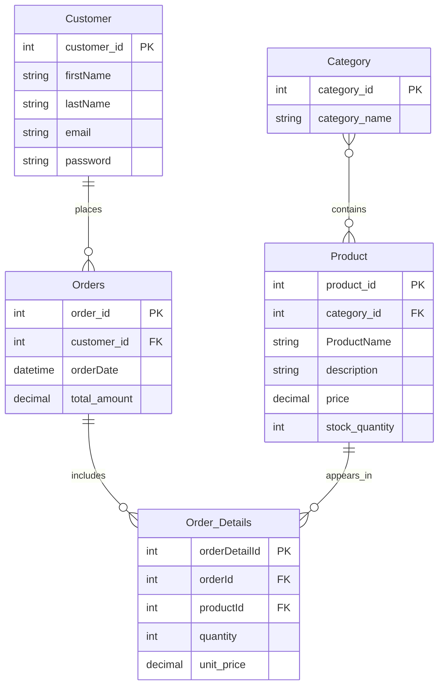

# E-Commerce Database Architecture

This repository contains a sample **E-Commerce database** with schema, relationships, sample data, and SQL queries for reporting.

---

## Tasks

Given the sample entities, the following tasks are completed:

* Create the **DB schema script** with the entities:
  - `Customer`
  - `Category`
  - `Product`
  - `Orders`
  - `Order_Details`
* Identify the **relationships** between entities.
* Draw the **ERD diagram** of this schema.
* Write SQL queries for:
  - Daily revenue report
  - Monthly top-selling products
  - Customers with total orders > $500 in the past month (including customer names and totals)
* Discuss **denormalization strategies** for `Customer` and `Orders`.

---

## ERD

## sql Queries
- [DataBase schema](./Database_Schema.sql)
- [data](./data.sql)
- [Daily Revenue Report](./Daily_Revenue_Report.sql)
- [Monthly Top-Selling Products](./Monthly_top_selling_products.sql)
- [Customers with Orders > $500 in the Past Month](./customer_with_orders_500.sql)

