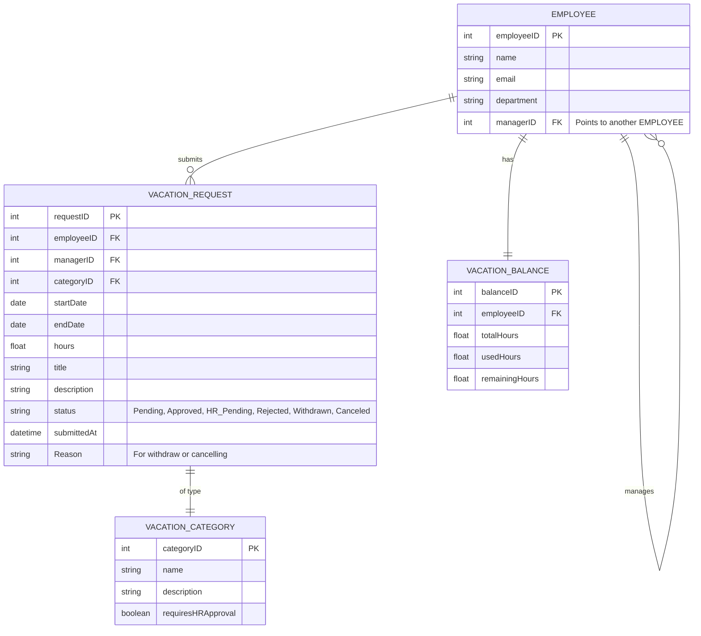
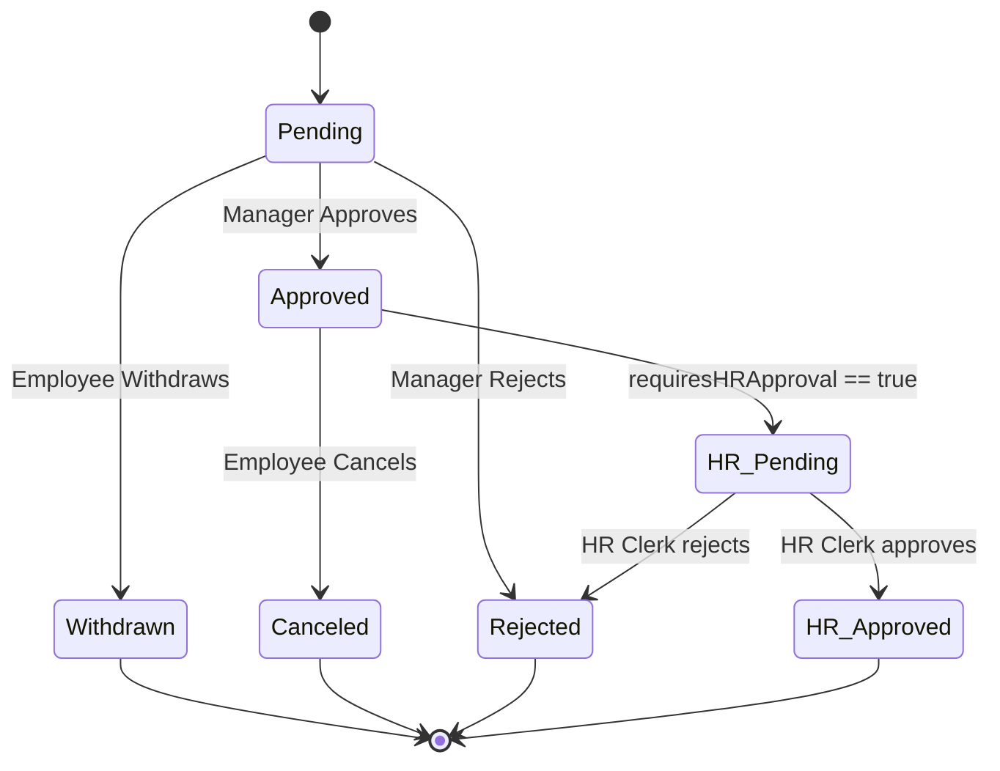
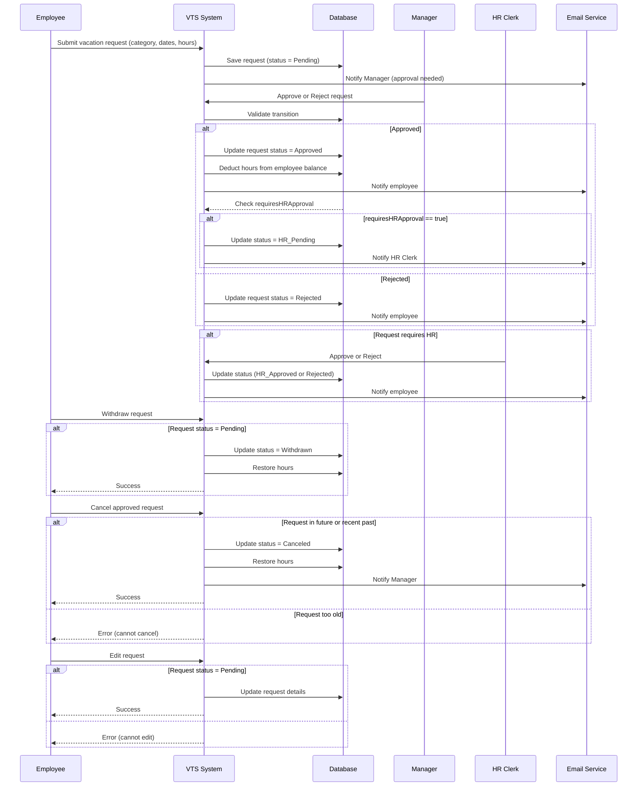

# Vacation-Tracking-System
A web-based system for managing employee leave requests and approvals.

### Vision

    A Vacation Tracking System (VTS) will provide individual employees with the
    capability to manage their own vacation time, sick leave, and personal time off,
    without having to be an expert in company policy or the local facility’s leave
    policies.

### Functional requirements
    1. Implements a flexible rules-based system for validating and verifying leave time requests
    2. Enables manager approval (optional)
    3. Provides access to requests for the previous calendar year, and allows
    requests to be made up to a year and a half in the future
    4. Uses e-mail notification to request manager approval and notify employees
    of request status changes
    5. Uses existing hardware and middleware
    6.  implemented as an extension to the existing intranet portal system, and
    uses the portal’s single-sign-on mechanisms for all authentication
    7. Keeps activity logs for all transactions
    8. Enables the HR and system administration personnel to override all actions
    restricted by rules, with logging of those overrides
    9. Allows managers to directly award personal leave time (with system-set
    limits)
    Provides a Web service interface for other internal systems to query any
    10. given employee’s vacation request summary
    11. Interfaces with the HR department legacy systems to retrieve required
    employee information and changes
### Non-Functional requirments
    
    1. Security -> authorized users,
    2.  Compatibility - > (Uses existing hardware and middleware ,implemented as an extension , integrate seamlessly with the corporate intranet)
    3. Usability -> Intuitive web interface requiring minimal training.
    4. Reliability & Availability -> The system should maintain high uptime and recover quickly from failures
    5. Performance – The system should handle concurrent requests without noticeable delay.

### Constraints 
    1. Authorized users
    2. Vacations and sick leave based on employment agreement.
## Domain 

    Human Resources (HR) / Employee Management
## System actors 
    1. Employee: The main user of this system. An employee uses this system to manage his or her vacation time.

    2. Manager: An employee who has all the abilities and goals of a regular employee, but with the added responsibility of approving vacation requests for immediate subordinates. A manager may award subordinates comptime, subject to certain limits set in the system.

    3. Clerk: A member of the HR department who has sufficient rights to view employees’ personal data and is responsible for ensuring that employees’information in all HR systems is up to date and correct. An HR clerk can add or remove nearly any record in the system. In the real world, HR clerks may or may not be employees; however, if they are employees, they use two separate login IDs to manage these two different roles.

    4. System Admin: A role responsible for the smooth running of the system’s technical resources (e.g., Web server, database) and for collecting and archiving all log files.

## ERD MODEL

## State Machine Diagram

## Sequence Diagram

## UI Mocks

 - [VTS Figma Mocks](https://www.figma.com/make/ZBSa7egj785uKbXE7OhYIp/Vacation-Tracking-System-UI?t=Y4exO36gPmWpBbfY&fullscreen=1)

## Documentation 

 - [Manage Time use case](useCases/Manage-time.md)
 - [Widthdraw Reuest](useCases/withdraw-request.md)
 - [Cancel Approved Request](useCases/cancel-approved-request.md)
 - [Edit Pending Request](useCases/edit-pending-request.md)
