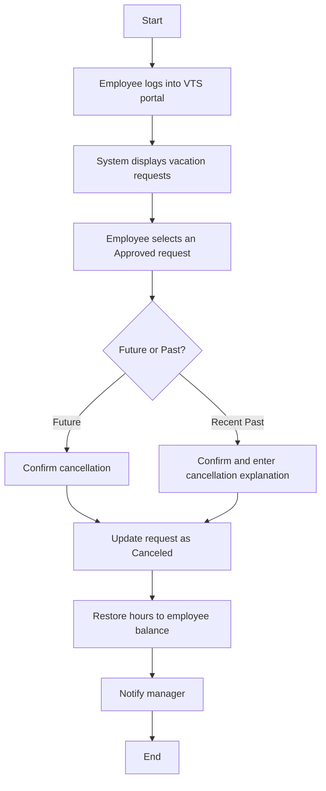
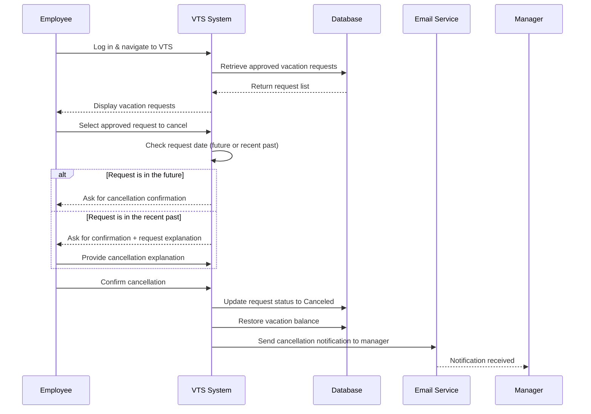

# Use Case: Cancel Approved Request

##  Description
**Actor:** Employee  
**Goal:** Employee wants to cancel a previously approved request.  

### Preconditions:
- Request status is **Approved**
- The vacation has not yet occurred OR occurred within the last 5 business days
- Employee is authenticated

### Main Flow:
1. Employee navigates to the VTS home page.
2. System displays vacation requests and balances.
3. Employee selects an already approved request scheduled in future (or recent past).
4. System prompts confirmation (if in recent past → prompt additional description).
5. Employee confirms cancellation.
6. Request is canceled and vacation hours are returned to employee balance.
7. System sends notification email to manager.
8. Employee is returned to main VTS page.

---

##  Flowchart Diagram

##  Sequence Diagram

## Pseudocode

    START

    IF Employee.isAuthenticated THEN
        Display(approvedRequests)
    ELSE
        EXIT
    END IF

    Request = Employee.selectApprovedRequest()

    // Determine whether request is in the future or recent past (<= 5 business days)
    IF VTS.isFuture(Request.date) THEN
        Confirm = Employee.confirmCancellation()
    ELSE IF VTS.isRecentPast(Request.date) THEN
        Confirm = Employee.confirmCancellation()
        Reason  = Employee.enterCancellationReason()
    END IF

    // If employee approves cancellation
    IF Confirm == TRUE THEN
        VTS.cancelRequest(Request)

        // Give hours back to employee
        VTS.restoreBalance(Request)

        // Notify direct manager
        VTS.notifyManager(Request, Reason)
    END IF

    END
