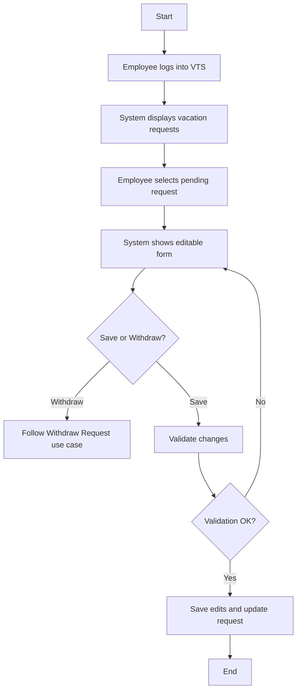
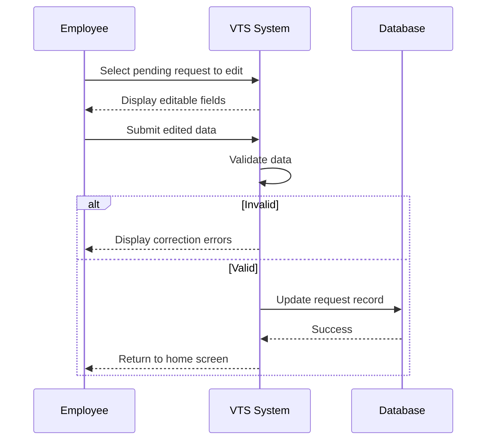

# Use Case: Edit Pending Request

## Description
**Actor:** Employee  
**Goal:** Employee edits title, comments, or dates of a pending request  

### Preconditions:
- Request status = **Pending approval**
- Employee is authenticated

### Main Flow:
1. Employee logs into VTS.
2. System shows vacation requests and balances.
3. Employee selects a pending request.
4. System shows editable form (title, dates, description).
5. Employee edits fields and submits changes.
6. If employee selects delete/withdraw instead, flow redirects to Withdraw Request.
7. System validates updated details and saves changes.

---

## Flowchart Diagram

## Sequence Diagram 

## Pseudocode

    START

    PendingRequest = Employee.selectPendingRequest()

    IF Employee.editsInformation THEN
        IF VTS.validateChanges THEN
            VTS.updateRequest(PendingRequest)
        ELSE
            Display(errors)
        END IF
    ELSE IF Employee.withdraws THEN
        Follow Withdraw Request use case
    END IF

    END