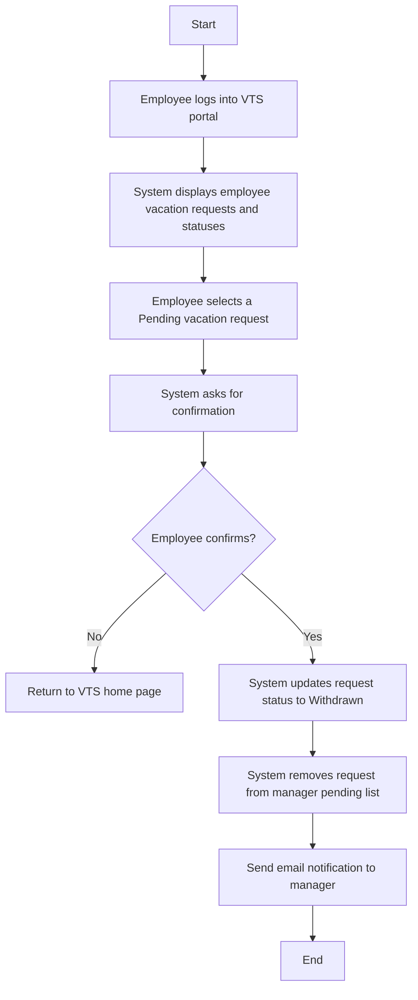
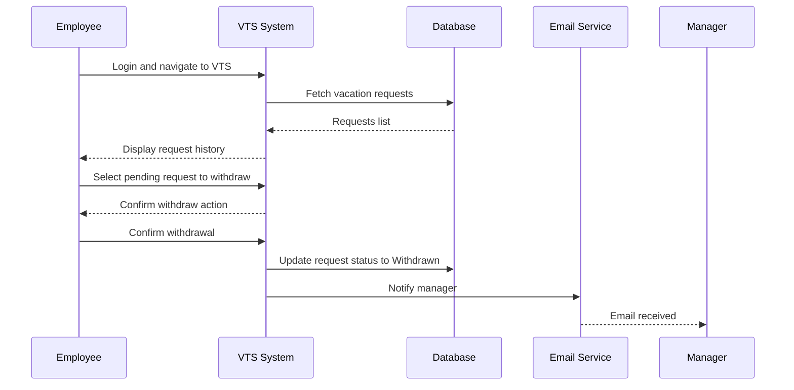

# Use Case: Withdraw Vacation Request

## ✅ Description
**Use case name:** Withdraw Request  
**Actor:** Employee  
**Goal:** Employee wants to withdraw a previously submitted request that is still pending approval.  

### Preconditions:
- A vacation request exists with status **Pending Approval**
- Employee is authenticated and authorized in VTS

### Main Flow:
1. Employee navigates to the VTS home page.
2. System displays list of vacation requests with current status.
3. Employee selects a request that is pending approval.
4. System prompts employee to confirm withdrawal.
5. Employee confirms request withdrawal.
6. System removes request from manager’s pending list.
7. System sends notification email to the manager.
8. System updates request status → **Withdrawn**

---

## 🧠 Flowchart Diagram

## Sequence Diagram;

## Pseudocode

    START

    IF Employee.isAuthenticated THEN
        Display(requests)
    ELSE
        EXIT
    END IF

    PendingRequest = Employee.selectPendingRequest()

    Confirm = Employee.confirmWithdraw()

    IF Confirm == TRUE THEN
        VTS.updateRequestStatus(PendingRequest, "Withdrawn")
        VTS.removeFromManagerPendingList(PendingRequest)
        VTS.notifyManager(PendingRequest)
    END IF

    END
